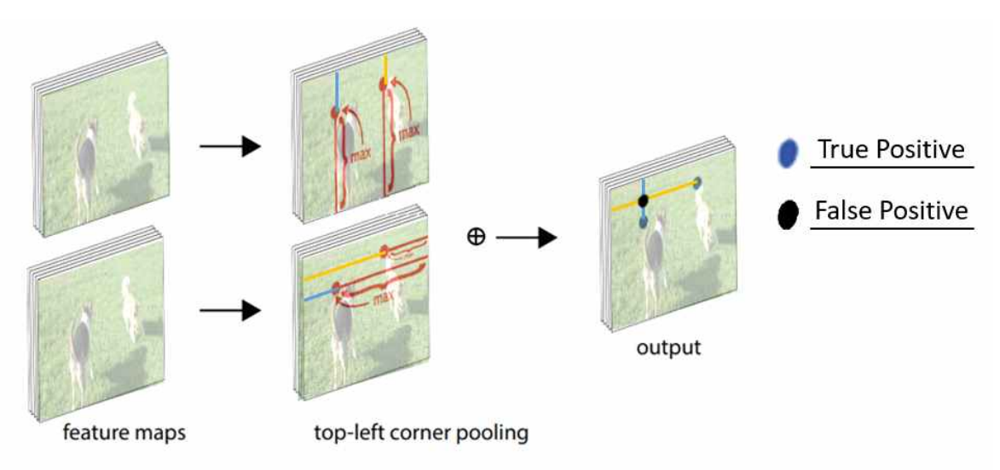

# LineNet : Training and Testing Code
This project is based on [CornerNet](https://github.com/princeton-vl/CornerNet-Lite). 

In this project, to find more accurate corner positions, we propose reducing loss on PFP(Predictable False Positive).



The corner pooling used to detect the corner features in the CornerNet has geometrical defect. 
Whenever same categorical objects are aligned in a diagonal position, the corner pooling makes the false positive due to mutual interference.
Because we can predict where it's occurred, we designate it as PFP(Predictable False Positive).  

Reducing loss on PFF method also increase the probability of false positive detection.
So, we propose a method to ensemble with the existing model at inference.
Through this, we can detect more accurate corner positions while maintaining low probability of false positive detection

## Getting Started
### Software Requirement
- Python 3.7
- PyTorch 1.0.0
- CUDA 10
- GCC 4.9.2 or above

### Installing Dependencies
Please first install [Anaconda](https://anaconda.org) and create an Anaconda environment using the provided package list `conda_packagelist.txt`.
```
conda create --name LineNet --file conda_packagelist.txt --channel pytorch
```

After you create the environment, please activate it.
```
source activate LineNet
```

### Compiling Corner Pooling Layers
Compile the C++ implementation of the corner pooling layers. (GCC4.9.2 or above is required.)
```
cd <LineNet dir>/core/models/py_utils/_cpools/
python setup.py install --user
```

### Compiling NMS
Compile the NMS code which are originally from [Faster R-CNN](https://github.com/rbgirshick/py-faster-rcnn/blob/master/lib/nms/cpu_nms.pyx) and [Soft-NMS](https://github.com/bharatsingh430/soft-nms/blob/master/lib/nms/cpu_nms.pyx).
```
cd <LineNet dir>/core/external
make
```

### Running the Demo Script
After downloading the models, you should be able to use the detectors on your own images. We provide a demo script `demo.py` to test if the repo is installed correctly.
```
python demo.py
```
This script applies LineNet to `demo.jpg` and writes the results to `demo_out.jpg`.

In the demo script, the default detector is LineNet. You can modify the demo script to test different detectors. For example, if you want to test LineNet:
```python
#!/usr/bin/env python

import cv2
from core.detectors import LineNet
from core.vis_utils import draw_bboxes

detector = LineNet()
image    = cv2.imread("demo.jpg")

bboxes = detector(image)
image  = draw_bboxes(image, bboxes)
cv2.imwrite("demo_out.jpg", image)
```

## Training and Evaluation

### Installing MS COCO APIs
```
mkdir -p <LineNet dir>/data
cd <LineNet dir>/data
git clone git@github.com:cocodataset/cocoapi.git coco
cd <LineNet dir>/data/coco/PythonAPI
make install
```

### Downloading MS COCO Data
- Download the training/validation split we use in our paper from [here](https://drive.google.com/file/d/1dop4188xo5lXDkGtOZUzy2SHOD_COXz4/view?usp=sharing) (originally from [Faster R-CNN](https://github.com/rbgirshick/py-faster-rcnn/tree/master/data))
- Unzip the file and place `annotations` under `<LineNet dir>/data/coco`
- Download the images (2014 Train, 2014 Val, 2017 Test) from [here](http://cocodataset.org/#download)
- Create 3 directories, `trainval2014`, `minival2014` and `testdev2017`, under `<LineNet dir>/data/coco/images/`
- Copy the training/validation/testing images to the corresponding directories according to the annotation files

To train and evaluate a network, you will need to create a configuration file, which defines the hyperparameters, and a model file, which defines the network architecture. The configuration file should be in JSON format and placed in `<LineNet dir>/configs/`. Each configuration file should have a corresponding model file in `<LineNet dir>/core/models/`. i.e. If there is a `<model>.json` in `<LineNet dir>/configs/`, there should be a `<model>.py` in `<LineNet dir>/core/models/`. There is only one exception which we will mention later.

### Training and Evaluating a Model
To train a model:
```
python train.py
```

We provide the configuration files and the model files for LineNet in this repo. Please check the configuration files in `<LineNet dir>/configs/`.
To select model, adjust configuration file `<LineNet dir>/config_debug.py`.

To evaluate the trained model:
```
python evaluate.py --testiter 500000 --split <split>
```

If you want to test different hyperparameters during evaluation and do not want to overwrite the original configuration file, you can do so by creating a configuration file with a suffix (`<model>-<suffix>.json`). There is no need to create `<model>-<suffix>.py` in `<LineNet dir>/core/models/`.

To use the new configuration file:
```
python evaluate.py <model> --testiter <iter> --split <split> --suffix <suffix>
```